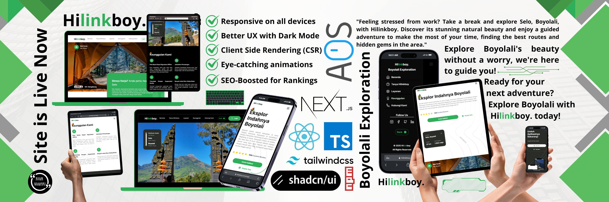

<div align="center">
    <h2 align="center">🏙️ Hilinkboy - Eksplor Keindahan Kota Boyolali</h2>
    
    <div>
        
        
        
  </div>
</div>

**Hilinkboy.** adalah sebuah website interaktif yang dirancang untuk mempromosikan wisata di Boyolali. Website ini membantu pengunjung menjelajahi keindahan Boyolali dengan lebih mudah dan terarah, menyediakan informasi lengkap tentang jalur pendakian, tempat wisata, dan aktivitas menarik lainnya. Dengan fitur dark mode, desain responsif, serta navigasi yang intuitif, **Hilinkboy.** menjadi panduan digital yang ideal bagi wisatawan untuk menikmati petualangan mereka di Boyolali dengan pengalaman yang lebih menyenangkan dan nyaman. 🌿🚶‍♂️

## 📋 <a name="table">Daftar Isi</a>

1. 🤖 [Deskripsi](#description)
2. ⚙️ [Kakas](#tech-stack)
3. 🌐 [Telah Mengudara](#mengudara)
4. 🚀 [Jalankan Di Lokal](#run-locally)
5. 🧑‍💻 [Kontributor](#contributor)
6. 🪪 [Lisensi](#license)

## <a name="description">🤖 Deskripsi</a>

**HilinkBoy** adalah sebuah proyek portofolio berbasis website yang dibuat menggunakan **Next.js**. Website ini dirancang untuk mempromosikan keindahan wisata di kawasan Boyolali, dengan menyediakan informasi seputar jalur pendakian, tempat wisata, dan aktivitas menarik lainnya.  

Dengan antarmuka modern dan fitur-fitur menarik, **HilinkBoy** dirancang untuk memberikan pengalaman yang lebih terarah dan nyaman bagi pengguna.  

### ✨ **Fitur Unggulan**  

- **Dark Mode**: Memberikan pengalaman browsing yang nyaman di segala kondisi pencahayaan.  
- **Desain Responsif**: Tampilan website yang optimal di berbagai perangkat, dari desktop hingga ponsel.  
- **Navigasi Mudah**: Menu intuitif yang memudahkan pengguna menjelajahi informasi wisata.  
- **SEO**: Website dibangun dengan pendekatan SEO untuk meningkatkan visibilitas di mesin pencari.  

### 📌 **Penafian**  

Website ini dibuat untuk keperluan portofolio dan demonstrasi kemampuan saja. Konten di dalamnya, seperti informasi wisata, mungkin tidak sepenuhnya akurat atau diperbarui. 🚀

## <a name="tech-stack">⚙️ Kakas</a>

- React + Next.js
- Tailwind CSS + shadcn/ui
- AOS JS

## <a name="mengudara">🌐 Telah Mengudara</a>

Website ini telah berhasil dideploy di Vercel dan dapat diakses melalui tautan berikut:
👉 [Hilinkboy - Explore The Beauty of Boyolali](https://hilinkboy.vercel.app/)

## <a name="run-locally">🚀 Jalankan Di Lokal</a>

Prosedur menjalankan projek ini di lokal:

```bash
  git clone https://github.com/ifwhy/hilinkboy.git
  cd hilinkboy
  npm i
  npm run dev
```

**Catatan:**
Jika Anda menggunakan `pnpm` atau `yarn`, sesuaikan langkah di atas.

## <a name="contributor">🧑‍💻 Kontributor</a>

- [Ivan Wahyu Nugroho](https://github.com/ifwhy)

## <a name="license">🪪 Lisensi</a>

[MIT](https://choosealicense.com/licenses/mit/)
